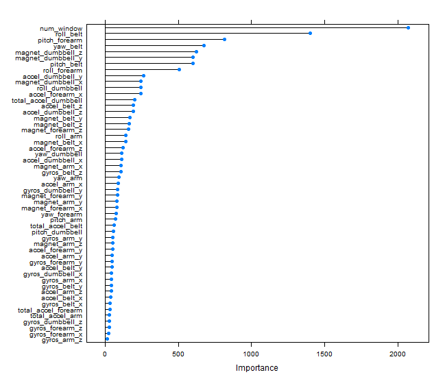

# Question
The assignment is to make a prediction for how well an activity is done based on activity tracker data.

# Input data pre-processing
The training data was available here:
[link](https://d396qusza40orc.cloudfront.net/predmachlearn/pml-training.csv)

The testing data was available here:
[link](https://d396qusza40orc.cloudfront.net/predmachlearn/pml-testing.csv)

I started by loading the training data and running some of the summary functions on it just to see what it contained. I used the following functions to do this (results are left out to save space):

```{r eval=FALSE}
#Data description
 summary(training)
 describe(training)
 head(training)
 sapply(training, class)
 str(training)
```

There were some obvious post-processing tasks that had to be done before selecting features:

Issue                                   | Solution
----------------------------------------|------------------------------------------
contains #DIV/0! and empty cells        | Change read.csv function (na.strings arg) to make these NA
6 first variables are uneccessary as they contain nothing of value to prediction | Remove columns
Mix of variable classes                 | Change all to numeric
Several columns have large amounts of NA values (>97%) | Remove columns 

The code that was used is given below:

```{r eval=FALSE}
# import data
training <- read.csv("pml-training.csv", na.strings = c("NA", "#DIV/0!", ""))
# remove uneccessary columns
trainfilt <- training[,-c(1:6)]
# make all into type numeric 
for(i in c(2:ncol(trainfilt)-1)){
        trainfilt[,i] = as.numeric(as.character(trainfilt[,i]))
}
# remove columns with almost all NA values
trainfilt <- trainfilt[colnames(trainfilt[colSums(is.na(trainfilt))==0])]

```

I tested with the nearZeroVar() function which did not report any variables having a near zero variance any longer.

# Methodology

I started by sub-dividing my data into a training and test set. Then, using the trainControl function, I setup a 3 fold cross validation control and used this in the train function with the random forest method. I then evaluated the result on the test set which gave a very good result of 99.88% accuracy. 

I then evaluated the feature importance in the model to see if any of the features should be removed. num_window, roll_belt and pitch_forearm were the three best predictors. In conclusion 




it is extremely important to use cross validation when running random forest algorithms

```{r, echo=FALSE}

```

