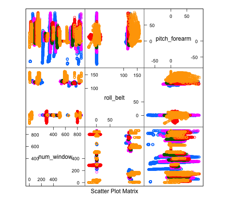

# Question
The assignment is to make a prediction for how well an activity is done based on activity tracker data.

# Input data pre-processing
The training data was available here:
[training data](https://d396qusza40orc.cloudfront.net/predmachlearn/pml-training.csv)

The testing data was available here:
[testing data](https://d396qusza40orc.cloudfront.net/predmachlearn/pml-testing.csv)

I started by loading the training data and running some of the summary functions on it just to see what it contained. I used the following functions to do this (results are left out to save space):

```{r eval=FALSE}
#Data description
 summary(training)
 describe(training)
 head(training)
 sapply(training, class)
 str(training)
```

There were some obvious post-processing tasks that had to be done before selecting features:

Issue                                   | Solution
----------------------------------------|------------------------------------------
contains #DIV/0! and empty cells        | Change read.csv function (na.strings arg) to make these NA
6 first variables are uneccessary as they contain nothing of value to prediction | Remove columns
Mix of variable classes                 | Change all to numeric
Several columns have large amounts of NA values (>97%) | Remove columns 

The code that was used is given below:

```{r eval=FALSE}
# import data
training <- read.csv("pml-training.csv", na.strings = c("NA", "#DIV/0!", ""))
# remove uneccessary columns
trainfilt <- training[,-c(1:6)]
# make all into type numeric 
for(i in c(2:ncol(trainfilt)-1)){
        trainfilt[,i] = as.numeric(as.character(trainfilt[,i]))
}
# remove columns with almost all NA values
trainfilt <- trainfilt[colnames(trainfilt[colSums(is.na(trainfilt))==0])]

```

I tested with the nearZeroVar() function which did not report any variables having a near zero variance any longer.

# Methodology

I started by sub-dividing my data into a training and test set. Then, using the trainControl function, I setup a 3 fold cross validation control and used this in the train function with the random forest method to create a model on the sub-training set. I used k-fold cross-validation with 3 folds, which means that there is more bias but less variance than a higher k. A higher k would result in significantly higher computational power needed. It is extremely important to use cross validation when running random forest algorithms, that's why I used this as part of the study design.

# Result
I thereby evaluated the result on the sub-test set using confusionmatrix which gave a very good result of 99.88% accuracy as well as a sensitivity and specificity of above 99% for the different outcomes. Since I have been using cross validation this should give a fairly good indication of the out of sample error although the in sample error will of course be slightly lower as there will be some over-fitting even when using cross validation. 

# Additional comments
I did try with a general linear model and also principal component analysis to combine and select features, but the accuracy of these methods were lower.  I also tried the RandomForest library, which was quicker, but did not allow for included Cross validation.

I then evaluated the feature importance in the model to see if any of the features should be removed. num_window, roll_belt and pitch_forearm were the three best predictors. In conclusion the amount of features could have been reduced since some are relatively unimportant. Since all features toghether gave such a accurate result I chose to maintain the model with all features.


From the scatter plot matrix (below) we see that there is no obvious linear relationship, which is probably why the random forest prediction is a very good predictor compared to a general linear model.



# Code snippet
Under is some of the most essential code which was used to create the machine learning algorithm:

```{r, eval=FALSE}

# Split training data into train and test to do cross-validation
inTrain <- createDataPartition(trainfilt$classe, p = 0.75, list = FALSE)
trainfilt.train <- trainfilt[inTrain,]
trainfilt.test <- trainfilt[-inTrain,]

#Build model with cross-validation
# define training control
train_control <- trainControl(method="cv", number=3)
# train the model 
model_cvRF <- train(classe~., data=trainfilt.train, trControl=train_control, method="rf")
# make predictions
predictions_cvRF <- predict(model_cvRF, newdata=trainfilt.test)
# summarize results
confusionMatrix(predictions_cvRF, trainfilt.test$classe)

# Check which variables are most important
importance <- varImp(model_cvRF, scale=FALSE)

```
